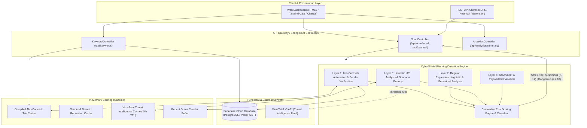

# CyberShield: Smart Web Security System for Phishing Detection
> **Engineering Final Year Project** &bull; **Department of Computer Science & Engineering / Information Security**

[](https://openjdk.org/)
[](https://spring.io/projects/spring-boot)
[](https://en.wikipedia.org/wiki/Aho%E2%80%93Corasick_algorithm)
[](https://supabase.com/)
[](https://virustotal.com)
[]()

---

## 1. Project Abstract
Phishing attacks have emerged as a major cybersecurity threat, targeting individuals and organizations through deceptive emails, fraudulent websites, and malicious URLs designed to steal sensitive information such as passwords, banking credentials, and personal data. As attackers continuously develop more sophisticated techniques, relying on conventional security measures alone can make it difficult to identify phishing attempts accurately and efficiently.

This project presents **CyberShield: Smart Web Security System for Phishing Detection**, a Java-based web application designed to identify phishing emails and malicious URLs using a **four-layer detection approach**:
1. **Layer 1**: Uses the **Aho-Corasick algorithm** to detect phishing-related keywords retrieved from a **Supabase** database, along with **sender verification** to identify potential email spoofing.
2. **Layer 2**: Performs **regular-expression-based pattern analysis** to identify suspicious language patterns, including urgency, credential requests, financial fraud indicators, and other phishing-related behaviors.
3. **Layer 3**: Conducts **heuristic URL analysis**, examining factors such as IP-based URLs, Shannon character entropy, URL structure, brand impersonation, and risky top-level domains (TLDs). URLs exceeding a predefined risk threshold are further verified using the **VirusTotal API**, with controlled API usage to improve efficiency.
4. **Layer 4**: Analyzes **email attachments** to identify potentially dangerous file types and suspicious characteristics (executables, container images, macro-enabled documents, double extensions, and MIME discrepancies).

To improve system performance, **caching mechanisms** (Caffeine in-memory cache) are implemented for phishing keywords, sender information, and VirusTotal results, reducing unnecessary database and API requests. A **cumulative risk-scoring mechanism** classifies inputs into three categories:
- **Safe**: Total Score $< 8.0$
- **Suspicious**: Total Score $8.0 - 17.9$
- **Dangerous**: Total Score $\ge 18.0$

---

## 2. System Architecture



---

## 3. Four-Layer Detection Pipeline

### Layer 1: Aho-Corasick Automaton & Sender Verification
- **Aho-Corasick Trie Algorithm**:
  - Time complexity: $\mathcal{O}(n + m + z)$, where $n$ is the input text length, $m$ is the total length of all keywords, and $z$ is the number of matches.
  - Unlike naive nested iteration ($\mathcal{O}(n \cdot k)$), the Aho-Corasick trie processes all keywords simultaneously in a single pass using Breadth-First Search (BFS) failure links and output dictionaries.
  - Phishing keywords are synchronized with **Supabase** and cached in memory.
- **Sender Verification**:
  - **Display Name Brand Impersonation**: Detects when display names claim trusted brands (e.g. `"PayPal Support"`) while the sender uses an unverified or free webmail address (e.g. `<support@gmail.com>` or `<alert@sec-update.xyz>`).
  - **Typosquatted & Lookalike Domains**: Employs Levenshtein distance to detect homoglyph variants (e.g., `paypa1.com`, `micros0ft.com`).
  - **Disposable Email Filtering**: Flags burner/temporary mail services (`tempmail.com`, `guerrillamail.com`).
  - **RFC 5322 Syntax Validation**: Identifies malformed addresses and forged headers.

### Layer 2: Regular Expression Linguistic & Behavioral Analysis
- **Urgency & Coercion Rules**:
  - Detects strict deadlines (`"within 24 hours"`, `"immediate action required"`, `"within 48 hours"`).
  - Flags punitive threats (`"account will be suspended"`, `"account frozen"`, `"unauthorized access detected"`).
- **Credential Harvesting Cues**:
  - Identifies direct calls to action (`"click here to verify your account"`, `"confirm your identity"`).
  - Flags solicitations for sensitive credentials (`"enter your password"`, `"provide your PIN"`, `"SSN"`).
- **Financial Fraud Patterns**:
  - Detects requests for non-reversible payments (`"wire transfer"`, `"bitcoin transaction"`, `"cryptocurrency payout"`).
  - Identifies fake prize or grant lures (`"you have won $5,000,000"`, `"tax refund approved"`).
- **Defense Evasion Triggers**:
  - Flags requests to bypass endpoint security (`"disable your antivirus"`, `"enable macros to view content"`).
  - Identifies isolation requests (`"do not share this email with IT support"`).

### Layer 3: Heuristic URL Analysis & VirusTotal Intelligence
- **IP-Based URLs**: Detects raw numerical IPv4/IPv6 hosts (e.g. `http://192.168.1.1/login.php`) frequently deployed by short-lived phishing kits.
- **Shannon Character Entropy**:
  $$H(S) = -\sum_{i=1}^{k} P(c_i) \log_2 P(c_i)$$
  Computes information entropy of the hostname. Hosts with $H(S) > 3.85$ bits indicate Algorithmic Domain Generation (DGA) or anti-filtering tokens.
- **Structural URL Heuristics**:
  - Excessive nested subdomains ($> 4$ segments).
  - UserInfo `@` sign obfuscation (`http://brand.com@attacker-server.com/login`).
  - URL length anomalies ($> 95$ characters).
  - Non-standard HTTP service ports (e.g., `:8080`, `:8443`, `:2082`).
  - Abusive / Risky Top-Level Domains (`.xyz`, `.top`, `.tk`, `.ml`, `.click`, `.zip`, `.mov`, `.buzz`, `.work`).
- **Brand Impersonation in URLs**: Identifies brands in subdomains (`paypal.com.scam-server.xyz`) and path masquerading (`/paypal/login.php`).
- **Conditional VirusTotal Verification**:
  - Triggered only when the heuristic risk score exceeds the predefined threshold ($\ge 6.0$).
  - Results cached for 24 hours to preserve API quotas (free tier: 4 requests/min).
  - Includes smart sandbox simulation mode when running offline without API keys.

### Layer 4: Email Attachment Threat Analysis
- **High-Risk Executables**: Flags direct executable and script payloads (`.exe`, `.scr`, `.bat`, `.cmd`, `.pif`, `.vbs`, `.js`, `.wsf`, `.hta`, `.cpl`, `.ps1`).
- **Container Disk Images**: Detects virtual disk formats (`.iso`, `.img`, `.vhd`) used to bypass Microsoft Mark-of-the-Web (MOTW) sandbox controls.
- **Macro-Enabled Documents**: Inspects Office formats with embedded VBA macros (`.docm`, `.xlsm`, `.pptm`).
- **Double Extension Deception**: Identifies right-to-left override and masquerade naming (e.g., `Invoice_Q4.pdf.exe`, `Statement.docx.vbs`).
- **MIME Discrepancy Verification**: Detects binary executable MIME types (`application/x-dosexec`) disguised with non-executable extensions.

---

## 4. Cumulative Risk Scoring & Classification

The cumulative risk score is calculated by summing the contributions from each layer:
$$\text{Total Risk Score} = \text{Score}_{L1} + \text{Score}_{L2} + \text{Score}_{L3} + \text{Score}_{L4}$$

| Score Range | Classification | Action / Advisory |
| :--- | :--- | :--- |
| **$< 8.0$** | <span style="color:#10b981; font-weight:bold;">SAFE</span> | Normal legitimate communication. No critical indicators flagged. |
| **$8.0 - 17.9$** | <span style="color:#f59e0b; font-weight:bold;">SUSPICIOUS</span> | Exercise caution. Multiple social engineering indicators present. Verify via out-of-band channels. |
| **$\ge 18.0$** | <span style="color:#ef4444; font-weight:bold;">DANGEROUS</span> | High-probability phishing attempt. Quarantine message, block sender, do not click links or download attachments. |

---

## 5. Technology Stack

- **Backend**: Java 17, Spring Boot 3.2.5 (Spring MVC, REST, Spring Validation).
- **String Algorithms**: Custom Aho-Corasick Multi-Pattern Automaton, Apache Commons Text (Levenshtein Distance).
- **Caching**: Caffeine High-Performance Cache (Google Guava evolution).
- **Database**: Supabase Cloud Database (PostgreSQL via PostgREST HTTP Client with in-memory fallback).
- **Threat Intelligence**: VirusTotal API v3 (URL-safe Base64 identifier hashing).
- **Frontend**: HTML5, Tailwind CSS, FontAwesome 6, Chart.js (Responsive Security Operations Center dashboard).
- **Testing**: JUnit 5, Mockito (22 unit tests passing).

---

## 6. Getting Started

### Prerequisites
- Java Development Kit (JDK) 17 or higher
- Windows, macOS, or Linux

### Quick Start (Windows)
Double-click `run.bat` or run in PowerShell:
```powershell
.\run.ps1
```
Or with Maven directly:
```bash
mvn spring-boot:run
```

The application will start at:
👉 **`http://localhost:8080/index.html`**

---

## 7. Supabase Database Integration (Optional)

CyberShield comes with 41+ vetted built-in phishing keywords and runs out-of-the-box in memory. To synchronize with your own **Supabase** cloud database:

1. Create a free project at [supabase.com](https://supabase.com).
2. Open the **SQL Editor** in Supabase and execute the script located at:
   ```
   src/main/resources/schema.sql
   ```
   Then populate initial keywords:
   ```
   src/main/resources/seed-data.sql
   ```
3. Set your environment variables (or update `src/main/resources/application.properties`):
   ```properties
   supabase.enabled=true
   supabase.url=https://your-project-id.supabase.co
   supabase.key=your-anon-or-service-role-key
   ```
4. Restart the application. CyberShield will pull keywords directly from Supabase and compile them into the Aho-Corasick automaton!

---

## 8. VirusTotal API Configuration (Optional)

To enable live VirusTotal threat intelligence queries:
1. Obtain a free API key at [virustotal.com/gui/my-apikey](https://www.virustotal.com/gui/my-apikey).
2. Set your environment variable:
   ```properties
   virustotal.api.key=YOUR_VIRUSTOTAL_API_KEY
   virustotal.risk.threshold=6.0
   ```
*Note: If no API key is provided, CyberShield operates in Sandbox Threat Feed mode for offline demonstrations.*

---

## 9. REST API Reference

| Method | Endpoint | Description |
| :--- | :--- | :--- |
| `POST` | `/api/scan/email` | Comprehensive 4-layer email scan |
| `POST` | `/api/scan/url` | Standalone heuristic URL & VirusTotal scan |
| `GET` | `/api/scan/{id}` | Retrieve diagnostic report by scan UUID |
| `GET` | `/api/scan/history` | List recent scans |
| `GET` | `/api/keywords` | List active Aho-Corasick phishing keywords |
| `POST` | `/api/keywords` | Add a new phishing keyword |
| `POST` | `/api/keywords/reload` | Recompile in-memory Aho-Corasick Trie |
| `GET` | `/api/keywords/supabase-status` | Check Supabase connection state |
| `GET` | `/api/analytics/summary` | Real-time threat stats and cache metrics |

---

## 10. Running Automated Tests

Run the complete test suite:
```bash
mvn test
```
The test suite validates:
- `AhoCorasickEngineTest`: Trie construction, BFS failure link traversal, overlapping keyword matching.
- `SenderVerificationTest`: Display name brand deception, lookalike typosquatting, disposable email providers.
- `RegexPatternAnalysisTest`: Urgency, credential theft, financial fraud, and macro execution patterns.
- `HeuristicUrlAnalysisTest`: Numerical IP URLs, Shannon character entropy, brand spoofing in subdomains, abusive TLDs.
- `AttachmentAnalysisTest`: Double extensions, executable files, container disk images, and macro documents.
- `CumulativeRiskScoringTest`: Threshold boundaries for Safe ($<8$), Suspicious ($8-17$), and Dangerous ($\ge 18$).

---

## 11. Viva Voce & Defense Presentation Guide

1. **Why Aho-Corasick instead of standard substring search (`String.contains`)?**
   - Naive search requires $\mathcal{O}(k \cdot n)$ iterations for $k$ keywords on a text of length $n$. As the keyword database grows (hundreds or thousands of patterns), naive search scales poorly.
   - The Aho-Corasick automaton processes the entire input text in a single $\mathcal{O}(n + m + z)$ pass using a deterministic finite-state automaton with failure transitions, making it computationally optimal.

2. **Why use Caffeine caching for VirusTotal?**
   - VirusTotal free tier limits users to 4 requests per minute (500/day). Caching scan results for 24 hours prevents duplicate API calls for frequently targeted URLs and prevents rate limit exhaustion.

3. **What is Shannon Entropy and why is it used?**
   - Shannon entropy measures information density and unpredictability: $H(S) = -\sum P(c) \log_2 P(c)$. Human-registered brand domains have natural linguistic character distributions (low entropy $\approx 2.5 - 3.2$), whereas algorithmically generated domains (DGA) and obfuscated redirect tokens exhibit high entropy ($> 3.85$), serving as a strong heuristic signal.

4. **How does the multi-layer approach prevent False Positives?**
   - A single weak indicator (e.g. an urgency phrase like "please reply today") only contributes 3–4 points and remains classified as **Safe** ($< 8$).
   - A message is only flagged as **Dangerous** ($\ge 18$) when multiple layers corroborate threat signals (e.g. spoofed sender + urgency + credential harvesting link + suspicious attachment).
